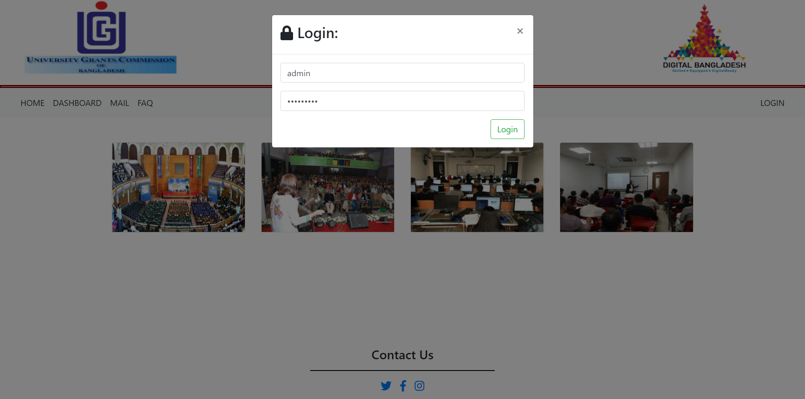

<h1 style="text-align:center">
UNIVERSITY DATA COLLECTION AND DISPLAY (UGC BASED)
</h1>

---

## **PROJECT DEVELOPED BY - GROUP-9**

## **PROJECT INTRODUCTION**
#### **University Grant Comission of Bangladesh (UGC Based)** is an under development website for the students and faculties or any users who can see and compare each private universities data.

## **HOW TO SETUP**
#### 1. Install Node.js and MongoDB on your computer.

#### 2. Download this code, and from command prompt run:
        npm install

        npm init

        npm install --save body-parser express http mongodb mongoose

        npm install passport passport-local passport-local-mongoose express-session

        npm install -g nodemon

#### 3. To run the code, run:

        nodemon server.js

#### 4. In the browser open http://localhost:3000/, and you should see the index page

## **PROJECT DOCUMENTAION**

* This is the home page of the website where only admin can login by pressing the **LOGIN** button to add new data for any univerisity. We used **Passport** authentication middlewire for authentication & security purpose to add cookies & sessions.

